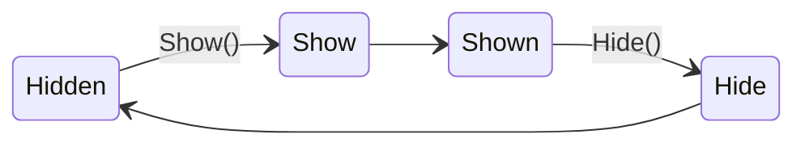
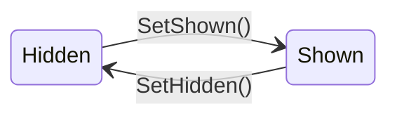
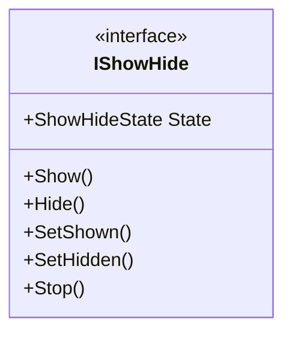
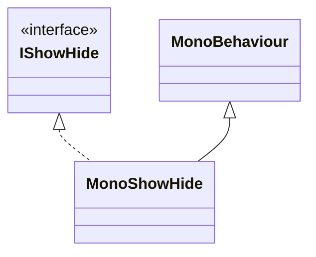

# **1. Overview**

`ShowHide` is a simple system for controlling the visibility of objects in Unity.
The system is based on an effect model with four states:

- `Shown` — the object is fully visible  
- `Hidden` — the object is fully hidden
- `Show` — the process of showing, transitioning to the `Shown` state
- `Hide` — the process of hiding, transitioning to the `Hidden` state





The main goal of the system is to standardize how show/hide effects are handled.
This provides the following benefits:
- the controlling code does not depend on how the effect is implemented
- effects can be easily replaced without modifying the control logic

The system does not impose any restrictions on implementation details:
- effects can be implemented using any approach (Animator, Tweening, Coroutines, etc.)
- any visual components can be used (UI, Sprite, Particle System, etc.)
All implementation details are encapsulated and hidden behind a unified control interface.


# **2. Code**
## IShowHide
A single interface `IShowHide` is used to work with effects.



It defines a standard set of methods for controlling object states:
- ``void Show()``   	- start showing
- ``void Hide()``	- start hiding
- ``void SetShown()`` 	- immediately set the state to Shown
- ``void SetHidden()`` 	- immediately set the state to Hidden
- ``void Stop()`` 	- interrupt the current transition

## MonoShowHide
`MonoShowHide` — is a ready-to-use Unity component that implements `IShowHide`.



## Creating Effects

Custom effects are built using the `IShowHide` interface and one of the state machine implementations responsible for object state transitions.

- `ShowHideCallbackStateMachine` — implements transitions using callback-based logic.
- `ShowHideUniTaskStateMachine` — implements transitions using asynchronous methods based on UniTask.

Effect implementations define only transition behavior, while the state machine handles state management and transition flow.  

Class templates for new effects are available via:  
`RMB → Create → Scripting → ShowHide`  

Templates include the basic `IShowHide` method implementations and state machine initialization.  
This approach avoids additional inheritance layers and repetitive boilerplate code.  

<details>
<summary> Example implementation </summary>
  
```csharp 
public sealed class ScaleShowHide : MonoShowHide
{
    private Tween _tween;
    private IShowHide _showHide;

    [SerializeField] private ShowHideState _initialState;
    [SerializeField] private bool _ignoreState;

    private void Awake()
    {
        _showHide = new ShowHideCallbackStateMachine(_initialState,
            _ignoreState,
            OnShow,
            OnHide,
            OnSetShown,
            OnSetHidden,
            OnStop);
    }

    private void OnShow(Action onCompleted)
    {
        _tween?.Kill();
        _tween = transform.DOScale(Vector3.one, 1f).OnComplete(() => onCompleted());
    }
    private void OnHide(Action onCompleted)
    {
        _tween?.Kill();
        _tween = transform.DOScale(Vector3.zero, 1f).OnComplete(() => onCompleted());
    }
    private void OnSetShown()
    {
        _tween?.Kill();
        transform.localScale = Vector3.one;
    }
    private void OnSetHidden()
    {
        _tween?.Kill();
        transform.localScale = Vector3.zero;
    }
    private void OnStop()
    {
        _tween?.Kill();
    }

    #region ShowHide
    public override IReadOnlyEventValue<ShowHideState> State => _showHide.State;
    public override void Show() => _showHide.Show();
    public override void SetShown() => _showHide.SetShown();
    public override void Hide() => _showHide.Hide();
    public override void SetHidden() => _showHide.SetHidden();
    public override void Stop() => _showHide.Stop();
    #endregion
}
```
</details> 

This approach allows you to:
- speed up the creation of new effects using the template
- use a unified interface across all effects
- replace implementations without changing the control logic
The system also supports asynchronous methods, enabling the use of `await` for sequential workflows.


# **3. Usage**
## Basic Scenario
Example of using an effect in code::

```csharp
[SerializeField] private MonoShowHide _effect;

public void ControlEffect()
{
    // start showing
    _effect.Show();

    // start hidding
    _effect.Hide();

    // state check
    if (_effect.State.Value != ShowHideState.Hidden)
    {
        _effect.State.Changed += OnStateChanged;
    }
}
```

## Asynchronous Scenario
```csharp
private CancellationTokenSource _cts;
private IObjectPool<MonoShowHide> _portalsPool;

public async UniTask SpawnEnemyWithPortal()
{
    using var handle = _portalsPool.Get(out var portal);
    await portal.ShowAsync(_cts.Token);
    await SpawnEnemy();
    await portal.HideAsync(_cts.Token);
}
```

## Installation

UPM - `https://github.com/CatCodeGames/StatefulEffects.git?path=Assets/StatefulEffects`


---


# **1. Описание**

`ShowHide` — простая система для управления показом и скрытием объектов в Unity.
Система основана на модели эффектов с четырьмя состояниями:

- `Shown` — объект полностью видим  
- `Hidden` — объект полностью скрыт  
- `Show` — процесс показа с переходом к состоянию `Shown`  
- `Hide` — процесс скрытия с переходом к состоянию `Hidden`  


Основная цель системы — стандартизация работы с эффектами показа и скрытия.
Благодаря этому:
- управляющий код не зависит от способа реализации эффектов
- эффекты можно легко заменять без изменения управляющей логики

Система не ограничивает способ реализации: 
- эффекты могут быть построены на любой другой логике (Animator, Tween, Coroutines и т.д.)
- использовать любые визуальные компоненты (UI, Sprite, Particle System и др.)
  
Все детали реализации инкапсулированы и скрыты за единым интерфейсом управления.


# **2. Код**
## IShowHide
Для работы с эффектами используется единый интерфейс IShowHide.


Он задаёт стандартный набор методов для управления состояниями объектов:
- ``void Show()``   	- начать показ
- ``void Hide()``	- начать скрытие
- ``void SetShown()`` 	- мгновенно установить состояние Shown
- ``void SetHidden()`` 	- мгновенно установить состояние Hidden
- ``void Stop()`` 	- прервать текущий переход

## MonoShowHide
``MonoShowHide`` — готовый компонент для Unity, который реализует IShowHide.


## Создание эффектов
Для создания собственных эффектов используется интерфейс `IShowHide` и одна из реализаций машины состояний, управляющей переходами между состояниями объекта.

- `ShowHideCallbackStateMachine` - реализует переходы через callback-вызовы.
- `ShowHideUniTaskStateMachine` - реализует переходы через асинхронные методы на базе UniTask.

Конкретный эффект реализует только поведение переходов, а управление состояниями и последовательностью переходов выполняет машина состояний.  

Для создания новых эффектов предусмотрены шаблоны классов, доступные через:  
`ПКМ → Create → Scripting → ShowHide`.  

Шаблоны содержат базовую реализацию методов интерфейса `IShowHide` и создание машины состояний.  
Такой подход позволяет избежать дополнительного наследования и повторения однотипного boilerplate-кода.

<details>
<summary> Пример реализации </summary>
  
```csharp 
public sealed class ScaleShowHide : MonoShowHide
{
    private Tween _tween;
    private IShowHide _showHide;

    [SerializeField] private ShowHideState _initialState;
    [SerializeField] private bool _ignoreState;

    private void Awake()
    {
        _showHide = new ShowHideCallbackStateMachine(_initialState,
            _ignoreState,
            OnShow,
            OnHide,
            OnSetShown,
            OnSetHidden,
            OnStop);
    }

    private void OnShow(Action onCompleted)
    {
        _tween?.Kill();
        _tween = transform.DOScale(Vector3.one, 1f).OnComplete(() => onCompleted());
    }
    private void OnHide(Action onCompleted)
    {
        _tween?.Kill();
        _tween = transform.DOScale(Vector3.zero, 1f).OnComplete(() => onCompleted());
    }
    private void OnSetShown()
    {
        _tween?.Kill();
        transform.localScale = Vector3.one;
    }
    private void OnSetHidden()
    {
        _tween?.Kill();
        transform.localScale = Vector3.zero;
    }
    private void OnStop()
    {
        _tween?.Kill();
    }

    #region ShowHide
    public override IReadOnlyEventValue<ShowHideState> State => _showHide.State;
    public override void Show() => _showHide.Show();
    public override void SetShown() => _showHide.SetShown();
    public override void Hide() => _showHide.Hide();
    public override void SetHidden() => _showHide.SetHidden();
    public override void Stop() => _showHide.Stop();
    #endregion
}
```
</details> 

Такой подход позволяет:
- ускорить создание новых эффектов за счёт шаблона
- использовать единый интерфейс для всех эффектов
- заменять реализацию без изменения управляющего кода

Система также поддерживает асинхронные методы, что позволяет использовать `await` для последовательных сценариев.


# **3. Использование**
## Базовый сценарий
Пример использования эффекта в коде:

```csharp
[SerializeField] private MonoShowHide _effect;

public void ControlEffect()
{
    // запустить показ
    _effect.Show();

    // запустить скрытие
    _effect.Hide();

    // проверка состояния
    if (_effect.State.Value != ShowHideState.Hidden)
    {
        _effect.State.Changed += OnStateChanged;
    }
}
```

## Асинхронный сценарий
```csharp
private CancellationTokenSource _cts;
private IObjectPool<MonoShowHide> _portalsPool;

public async UniTask SpawnEnemyWithPortal()
{
    using var handle = _portalsPool.Get(out var portal);
    await portal.ShowAsync(_cts.Token);
    await SpawnEnemy();
    await portal.HideAsync(_cts.Token);
}
```

## Установка
UPM - `https://github.com/CatCodeGames/StatefulEffects.git?path=Assets/StatefulEffects`
